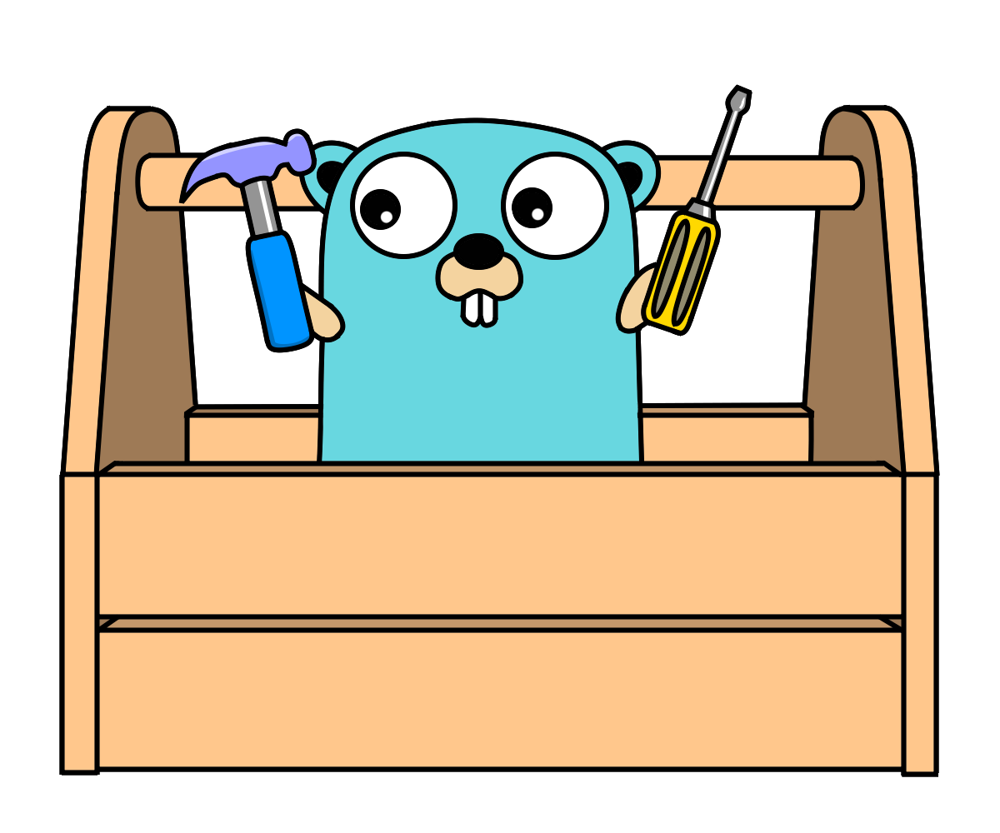

# Go Toolbox

Useful tools for many uses.

    

This toolbox contains:

- **[Collections](./collections/)**
  - **[Dictionaries](./collections/dictionary.go)**
    - [dictionary](./collections/dictionary/)
    - [readonlyDictionary](./collections/readonlyDictionary/)
    - [sortedDictionary](./collections/sortedDictionary/)
  - **[Enumerators](./collections/enumerator.go)**
    - [enumerator](./collections/enumerator.go)
    - [iterator](./collections/iterator.go)
  - **[List](./collections/list.go)**
    - [linkedList](./collections/linkedList/)
    - [list](./collections/list/)
    - [readonlyList](./collections/readonlyList/)
    - [readonlyVariantList](./collections/readonlyVariantList/)
  - **[Predicates](./collections/predicate.go)**
    - [predicate](./collections/predicate/)
  - **[Queues](./collections/queue.go)**
    - [capQueue](./collections/capQueue/)
    - [queue](./collections/queue/)
    - [readonlyQueue](./collections/readonlyQueue/)
  - **[Set](./collections/set.go)**
    - [set](./collections/set/)
    - [readonlySet](./collections/readonlySet/)
  - **[Stacks](./collections/stack.go)**
    - [capStack](./collections/capStack/)
    - [readonlyStack](./collections/readonlyStack/)
    - [stack](./collections/stack/)
  - [Tuple](./collections/tuple.go)
    - [tuple1](./collections/tuple1/)
    - [tuple2](./collections/tuple2/)
    - [tuple3](./collections/tuple3/)
    - [tuple4](./collections/tuple4/)
- **[Diff Tools](./differs/diff.go)**
  - [diff](./differs/diff/)
- **[Toolbox Errors](./terrors/terror.go)**
  - [terror](./terrors/terror/)
- **[Testers](./testers/check.go)**
  - [check](./testers/check/)
- **[Utils](./utils/)**
